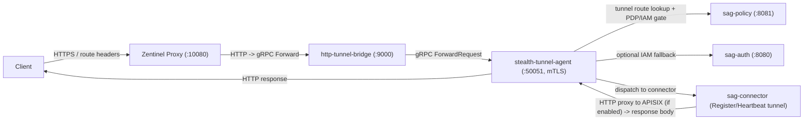
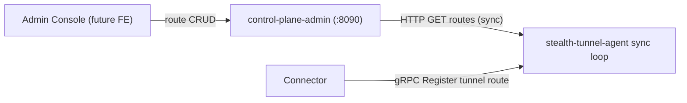

# SAG Cloud - Context Handoff

Last updated: 2026-04-14 (Woo 内网机 `192.168.9.26`；完成 sag-auth OIDC/4A 标准化第 1 阶段)

## 重要记忆：Windows 开发 → Linux 部署（每次改代码必做）

- **开发环境**：日常在 **Windows** 上编辑本仓库（路径如本机工作区）；**部署/验收**在 **Linux 服务器**（VM / 生产机）上用同一套 `docker compose` 跑起来。
- **强制流程（助手与用户约定）**：
  1. 在 Windows 上完成修改后：**`git add` → `git commit` → `git push origin clean-main`**（或当前约定分支），**不要**只改文件不推送就结束会话。
  2. 在 Linux 上：`git pull`，再按变更执行 **`docker compose up -d --build`**（或至少重建/重启受影响服务，如 `sag-auth`、`fake-4a`、`frontend-admin-next`）。
- **原因**：服务器不会自动拿到本机磁盘上的文件；不 push / 不 pull 就会出现「本机已修、线上仍旧」的假问题。
- **本仓库 Git 根目录**：`sag-cloud/`（不是上级 `Secure_Access_Gateway_SAG/` 根目录）。
- **内网 Linux 部署机（固定写死，文档与命令里不再用占位符）**：**`192.168.9.26`**。浏览器从办公机访问统一前端示例：`http://192.168.9.26:3001`；`SAG_PUBLIC_HOST`、冒烟脚本 `-VmHost`、Fake 4A 外链等 **默认均按此地址**（若换机器再全局替换）。

## 执行纪律（防上下文遗忘）

- 根目录使用 `TEMP_TODOS_TRACKER.md` 维护当前 todo 队列与状态。
- 每完成一个 todo，必须完成以下动作再进入下一个：
  1. 代码检查通过（至少受影响模块 `cargo check` / 前端 lint）；
  2. `git commit`；
  3. `git push`；
  4. 同步更新 `README.md` 与本文件（提交记录 + 部署提示）。
- Linux 端同步动作固定为：
  - `git pull`
  - `docker compose up -d --build --force-recreate <受影响服务>`

## 本次新增进展（sag-auth OIDC/4A 标准化）

- `sag-auth` 的 `/api/v1/auth/sso/login` / `/api/v1/auth/sso/callback` 已升级为可配置 identity provider：
  - 默认 `provider_id=foura`
  - 支持 `provider_id=oidc`
- OIDC 授权码流程已接通：
  - token 交换
  - userinfo 拉取
  - `groups` 从 token/userinfo 聚合写入 JWT 的 `external_groups`
- 身份源配置页中 `identity_providers` 可覆盖 provider 级 `client_id/client_secret/scopes`（在运行时生效）。

## 本次新增进展（sag-policy 角色映射 API）

- 新增 `POST /api/v1/identity/map-roles`：
  - 输入 `provider_id + external_groups + base_roles`
  - 输出 `effective_roles + matched_rules`
- 该 API 复用了共享存储中的 `group_role_mappings`，可直接作为门户权限闭环和后续策略联动的角色归一入口。

## 本次新增进展（用户门户权限测试闭环）

- `frontend-portal` 新增了 `/api-control` 代理，用于读取应用主数据。
- 门户新增“我的授权应用”列表：基于 `control-plane-admin` 应用列表 + `sag-policy` 评估结果展示当前账号可访问应用。
- 每条授权应用提供“测试访问”按钮，直接触发网关探测闭环（Bearer + `x-sag-app-id` + 用户角色头）。
- 本地构建验证提示：当前终端环境缺少前端依赖（`vite` 未安装到 PATH），需在目标环境先执行 `npm install` 再 `npm run build`。

## 本次新增进展（审计中心 MVP）

- 共享存储新增 `audit_logs` 模型与查询过滤器。
- `control-plane-admin` 增加审计采集/查询 API：
  - `POST /api/v1/audit/logs`
  - `GET /api/v1/audit/logs?from_ts_ms=&to_ts_ms=&user_id=&app_id=&limit=`
- `frontend-admin-next` 新增 `/ops/audit` 查询页，支持按用户和应用过滤。

## 本次新增进展（统一监控入口）

- `frontend-admin-next` 新增 `/ops/observability`，整合 workflow/apps/Grafana/Prometheus。
- 提供统一入口按钮 + Grafana/Prometheus 内嵌预览，便于运维人员单页巡检。

## 本次修复（4A/OIDC 回调错误跳到 127.0.0.1）

- 修复 `sag-auth` 回调后门户跳转解析逻辑，禁止回退到 `127.0.0.1`。
- 新优先级：
  1. `SAG_SSO_PORTAL_REDIRECT_URL`
  2. `SAG_PUBLIC_HOST`（例如 `192.168.9.26`）
  3. 默认 `http://192.168.9.26:3001/app`

## 0) Recent Session Delta (2026-04-09)

- Current session follow-up completed:
  - Verified and pushed zentinel stabilization commit on branch `clean-main` (`95bcc623`), including:
    - `docker-compose.yml`: zentinel startup switched to `/workspace` + `--manifest-path /workspace/proxy/core/Cargo.toml`.
    - `frontend-admin-next/src/app/workflow/page.tsx`: workflow health adds N1 probe override (north 5xx => zentinel down).
  - Runtime validation after restart:
    - `N1`: `GET http://127.0.0.1:3001/api-zentinel/api/test` => `200`
    - `T1`: `GET http://127.0.0.1:9000/api/test` => `200`
  - Documentation sync completed for deployment handoff:
    - `README.md`: added section "10.12 zentinel 启动与 TLS 预防性治理（重点）"
    - `DEPLOYMENT_README.md`: added zentinel startup behavior and TLS preflight checklist
    - `docs/ops/deployment-compose.md`: added startup guardrails + certificate preflight + acceptance probes

- Frontend baseline switched to `frontend-admin-next` (`http://127.0.0.1:3001`), and legacy Vite admin capabilities are integrated into `/control`.
- Portal admin jump default changed to `http://127.0.0.1:3001`; visible roles updated to `admin/boss/ops`.
- Added Fake 4A (`infra/fake-4a`) to simulate 4A OAuth2 auth-code flow for demos when customer 4A is not exposed:
  - One-click SSO: `sag-auth` callback can 302 redirect into portal with `sso_token` (`SAG_SSO_PORTAL_REDIRECT_URL`).
  - Demo-only role map: `SAG_FOURA_ROLE_MAP="boss:boss;alice:tech;bob:ops"`.
  - Guest preview entry to demonstrate gateway blocking when identity is missing (expected 403).
  - `state` is one-time + ~10min TTL; browser back reuse triggers `invalid or expired state` (expected).
- TLS trust hardening in containers:
  - Frontend containers trust Zentinel CA via `NODE_EXTRA_CA_CERTS`.
  - Zentinel TLS cert SAN does not include docker DNS `zentinel`; use SNI-compatible host (`example.com`) with `/etc/hosts` mapping (`extra_hosts`) for in-network calls.
- Observability health unknown nodes were wired to Prometheus jobs (`apisix` / `grafana` / `mock-workload`) and workflow status can be resolved by `up{job=...}`.
- Git remote bootstrap is completed via SSH (`origin` now uses `git@192.168.14.10:...`), and code was successfully pushed after merging remote initialized `main` into local `clean-main`.
- Ongoing development branch note: local workspace may still have branch `clean-main` for snapshot history continuity; normal follow-up commits can continue on the currently tracked branch.
- Dual-host reliability validation was executed end-to-end with fault injection:
  - Injected wrong connector TLS SNI (`SAG_GRPC_TLS_SERVER_NAME=wrong-sni.local`) -> connector failed with cert-name mismatch -> data plane failed closed (`502 no connector stream`).
  - Injected wrong connector endpoint (`SAG_TUNNEL_ENDPOINT=https://not-exist-edge.local:50051`) -> DNS resolution failure -> data plane failed closed.
  - Stopped `stealth-tunnel-agent` on edge -> connector stream dropped and north/south tunnel path returned `502 transport error`; recovered after agent+connector restart.
  - Restored correct values (`SAG_GRPC_TLS_SERVER_NAME=localhost`, valid endpoint) -> bridge path recovered to HTTP 200.
- Runtime stabilization fixes for dual-host edge startup:
  - `docker-compose.edge.yml`: changed `zentinel` startup to run from `/workspace` with explicit `--manifest-path /workspace/proxy/core/Cargo.toml` to avoid `proxy/core` toolchain sync blocking during container startup.
  - `proxy/zentinel-proxy/config/dataplane-compose.kdl`: switched TLS cert/key to absolute paths under `/workspace/proxy/core/tests/fixtures/tls/*` to keep HTTPS listener valid after working directory change.
- Validation outcome:
  - `http-tunnel-bridge` path: `GET http://127.0.0.1:9000/api/test` -> `200` after route+connector alignment.
  - `zentinel` north ingress: `GET https://example.com:10080/api/test` (host mapped to local zentinel) -> `200` after listener/cert-path fix.

## 1) Current Objective

Primary goal status: **Phase-1 delivered** (single-host + dual-host templates + dashboard/health-check baseline).

Current objective in-progress: **stabilize metrics-driven operations and service-level dashboards**:

`(optional) Public Edge -> Zentinel (external HTTPS) -> http-tunnel-bridge -> stealth-tunnel-agent (IAM/PDP) -> connector -> response`

Important strategy change:

- Keep `Zentinel` as external zero-trust gateway (**mandatory in compose**, not optional)
- Introduce `APISIX` as intranet traffic layer for L7 routing/governance
- Gradually replace connector traffic-dispatch role (connector keeps access/tunnel role)
- APISIX routing/proxy is now wired as the **standard path** (connector must forward to APISIX; no echo fallback)

## 2) What Is Already Implemented

### Core crates/services

- `services/control-plane-admin`
  - Route CRUD for tunnel routes
  - Intranet upstream mapping CRUD (`app_id` -> upstream host:port + scheme)
  - Persistence backend selectable: SQLite / PostgreSQL (compose uses PostgreSQL)
  - Optional APISIX downlink: when `SAG_APISIX_ADMIN_BASE_URL` + `SAG_APISIX_ADMIN_API_KEY` are set, it upserts `sag-route-{app_id}` for each app_id
- `services/sag-auth`
  - `/api/v1/auth/login` and `/api/v1/auth/verify`
  - Argon2 password verification, JWT issue/verify, in-memory sessions
- `services/sag-policy`
  - `/api/v1/policies` (GET/POST), `/api/v1/policies/{id}` (DELETE), `/api/v1/policy/evaluate` (POST)
  - Priority-based ALLOW/DENY policy evaluation
  - TTL decision cache (moka)
  - Persistence backend selectable: SQLite / PostgreSQL (compose uses PostgreSQL)
- `proxy/agents/stealth-tunnel-agent`
  - gRPC tunnel service
  - Connector register/heartbeat/request-response mapping
  - Route sync from control-plane
  - PDP check before forward (calls `sag-policy`)
  - IAM fallback: if identity headers absent, can call `sag-auth/verify` using Bearer token
- `proxy/connectors/sag-connector`
  - Registers to tunnel
  - Sends heartbeat
  - Proxies HTTP to APISIX (mandatory). `SAG_APISIX_BASE_URL` is required.
  - `SAG_MESH_MODE=noop|ambient` controls MeshTlsProvider stub (currently noop)
- `proxy/http-tunnel-bridge`
  - HTTP -> gRPC ForwardRequest adapter
  - ForwardResponse -> HTTP response mapping
  - `/metrics` endpoint (request count/latency/status)
- `proxy/public-edge` (local PoC sidecar)
  - TLS 终止（HTTPS 入口）
  - 基础通用防护（IP 限流 / 请求体大小限制 / 路径/方法阻断）
  - correlation_id 透传/注入，并在拒绝时返回结构化 JSON + `x-sag-reject-layer/x-sag-reject-reason`
  - 反向代理到下游 `Zentinel`（默认 `https://127.0.0.1:10080`）

### New observability/deployment baseline (2026-04-08)

- Added dual-host deployment templates:
  - `docker-compose.edge.yml`
  - `docker-compose.intra.yml`
  - `.env.dualhost.example`
- Added observability stack in compose:
  - `otel-collector`
  - `prometheus` (host `:9091`)
  - `grafana` (host `:3000`)
- Prometheus scrape now includes:
  - management plane: `control-plane-admin`/`sag-auth`/`sag-policy`
  - dataplane chain: `http-tunnel-bridge`/`stealth-tunnel-agent`/`sag-connector`
  - zentinel proxy/core metrics (`zentinel:9090/metrics`)
- Admin console (`frontend`) now includes:
  - Dashboard tab with split metrics (management vs zentinel)
  - Self-check tab for one-click diagnostic

### Workspace/tests status

- Workspace members currently include:
  - `shared/storage`
  - `proxy/agents/stealth-tunnel-agent`
  - `proxy/connectors/sag-connector`
  - `proxy/http-tunnel-bridge`
  - `services/control-plane-admin`
  - `services/sag-auth`
  - `services/sag-policy`
- `cargo test --workspace` is passing on Windows for SAG workspace crates.

### Environment variables (reference)

Authoritative table: **`README.md` → section `2.3 SAG 各服务环境变量速查`**.

Minimum set for local dev / compose:

- **Storage backend (Edge persistence services only; intentionally not consumed by `sag-connector`)**:
  - SQLite: `SAG_STORAGE_DB_PATH` — use the **same path** for `control-plane-admin` and `sag-policy`.
  - PostgreSQL: `SAG_STORAGE_BACKEND=postgres`, `SAG_POSTGRES_DSN=...` (compose default)
- The Connector requires the Edge tunnel endpoint and mTLS material, but no database DSN. Central persistence is owned by Edge services.
- **APISIX downlink (control-plane)**: `SAG_APISIX_ADMIN_BASE_URL` (e.g. `http://127.0.0.1:9180`), `SAG_APISIX_ADMIN_API_KEY` (**must match** APISIX `deployment.admin.admin_key.key` in `config.yaml`).
- **APISIX data plane (connector)**: `SAG_APISIX_BASE_URL` (e.g. `http://127.0.0.1:9080`); unset to keep connector echo demo.
- **Mesh stub (connector)**: `SAG_MESH_MODE=noop|ambient`.
- **Public Edge PoC sidecar（可选）**:
  - 服务监听/回源：`PUBLIC_EDGE_LISTEN_ADDR`（默认 `0.0.0.0:10443`）、`PUBLIC_EDGE_UPSTREAM_BASE_URL`（默认 `https://127.0.0.1:10080`）
  - TLS：`PUBLIC_EDGE_CERT_FILE` / `PUBLIC_EDGE_KEY_FILE`（PoC 默认回退到仓库测试证书）
  - 开启 smoke 层 00：`PUBLIC_EDGE_BASE_URL`（例如 `https://127.0.0.1:10443`）
- **Auth**: `SAG_JWT_SECRET`, `SAG_BOOTSTRAP_ADMIN_PASSWORD`.
- **Tunnel**: `SAG_TUNNEL_ENDPOINT`, `SAG_CONNECTOR_ID`, `SAG_APP_ID`, `SAG_EXTERNAL_HOST`; **Agent** `SAG_CONTROL_PLANE_SYNC_ENDPOINT`.
  - Compose note: because the default test cert SAN does not include docker DNS name `stealth-tunnel-agent`, set `SAG_GRPC_TLS_SERVER_NAME=localhost` for clients (connector/bridge) in compose.

**APISIX browser UI**: embedded dashboard at **`http://127.0.0.1:9180/ui/`** when `enable_admin_ui: true`; use the same key as Admin API. **403** on Docker Desktop: extend `allow_admin` (e.g. `172.16.0.0/12`). **401 wrong apikey**: key mismatch vs `config.yaml` — restart APISIX after edits.

**Intranet mock workload (e2e)**: `infra/test-workload/` — Docker Compose mock HTTP API on host **:18080**; pair with `app_id=test-app-mock`, intranet upstream `host.docker.internal:18080`, and `scripts/smoke-intranet-mock.ps1`. See [infra/test-workload/README.md](infra/test-workload/README.md).

## 3) Known Blocker (Important)

### Zentinel in `proxy/core` on Windows/MSVC

Running:

- `cargo run -p zentinel-proxy --bin zentinel -- --config ../zentinel-proxy/config/dataplane-verify.kdl`

fails on Windows due to `tokio::net::UnixListener/UnixStream` unresolved in `zentinel-agent-protocol` (unix-only code path).

This is **not** a business-logic error in SAG crates.

### Practical workaround

Run Zentinel (`proxy/core`) from **WSL/Linux**, while keeping SAG services on Windows if desired.

## 4) mTLS Settings (current defaults)

- External ingress (Zentinel listener): TLS only, client certificates are not required (`client-auth false` in KDL)
- Internal gRPC (http-tunnel-bridge <-> stealth-tunnel-agent <-> sag-connector): mTLS is enabled by default
- Internal gRPC mTLS switch: `SAG_GRPC_MTLS_ENABLED` (default `true`)
- Default certs/CA: `proxy/core/tests/fixtures/tls/*` (self-signed test material)

## 4) Important Files Added/Updated Recently

- `README.md` (expanded runbook + smoke flow + proxy/network troubleshooting)
- `scripts/cargo-no-proxy.ps1`
- `scripts/smoke-dataplane.ps1`
- `proxy/zentinel-proxy/config/dataplane-verify.kdl`
- `proxy/http-tunnel-bridge/*`
- `proxy/agents/stealth-tunnel-agent/src/grpc_server.rs` (IAM+PDP integrated forward gate)
- `proxy/agents/stealth-tunnel-agent/src/*integration_test.rs`
- `services/sag-auth/src/main.rs`
- `services/sag-policy/src/main.rs`
- `services/control-plane-admin/src/main.rs`

## 5) Recommended Startup Order (Docker-first)

From `sag-cloud` (single-host docker-compose recommended):

```bash
docker compose down
docker compose build control-plane-admin sag-auth sag-policy stealth-tunnel-agent sag-connector http-tunnel-bridge zentinel
docker compose up -d postgres etcd apisix mock-workload control-plane-admin sag-auth sag-policy stealth-tunnel-agent sag-connector http-tunnel-bridge zentinel otel-collector prometheus grafana frontend-admin-next frontend-portal company-demo-sites
```

Then verify:

```bash
curl http://127.0.0.1:8090/health
curl http://127.0.0.1:8080/health
curl http://127.0.0.1:8081/health
curl http://127.0.0.1:9091/-/ready
```

Notes:
- Manual per-service startup is no longer the primary path; keep it only for deep debugging.
- Current baseline assumes `docker compose` as the default run mode for dev/test/demo.
- If you see repeated logs in agent:
  - `sync routes http failed url=http://127.0.0.1:8090/...` then immediate
  - `sync routes ok url=http://control-plane-admin:8090/...`
  this is expected fallback behavior (localhost endpoint is attempted first, then compose service DNS succeeds).

## 6) Quick Validation Commands

- Unit/integration tests:
  - `cargo test --workspace`
- Data-plane smoke (requires services up):
  - `.\scripts\smoke-dataplane.ps1`
  - (WSL/Linux) `bash ./scripts/smoke-dataplane-wsl.sh` (now fixed + passing)
- Docker compose path:
  - First time: `docker compose build && docker compose up -d` (Rust services need `protoc/cmake` inside the image)
  - `docker compose up -d` now starts zentinel by default (no profile needed)
  - For this iteration (observability + tunnel metrics + rustls provider fix), recommended:
    - `docker compose up -d --build otel-collector stealth-tunnel-agent sag-connector http-tunnel-bridge`

### 6.1) Runtime notes after latest changes

- OTel collector config now uses `debug` exporter (replacing deprecated `logging` exporter).
- Rustls `CryptoProvider` panic in containerized TLS clients is fixed by explicit installation in:
  - `stealth-tunnel-agent`
  - `sag-connector`
  - `http-tunnel-bridge`

### Windows note (curl.exe vs zentinel TLS)

On some Windows environments, the system `curl.exe` (Schannel backend) fails TLS handshake with Pingora-based HTTPS listeners (e.g. zentinel on `:10080`) even with `-k`.
`scripts/smoke-dataplane.ps1` now automatically falls back to `wsl.exe curl` when it detects Schannel handshake failures, so N1 can still pass on Windows.
- Optional: public-edge ingress smoke
  - set `PUBLIC_EDGE_BASE_URL` then re-run `smoke-dataplane*.ps1` / `smoke-dataplane-wsl.sh`

## 7) 11-Module Progress Snapshot

1. Unified gateway: **MVP done** (external HTTPS ingress wired)
2. IAM: **MVP done**
3. PDP/PA: **MVP done**
4. App management/low-code: **MVP done for demo** (no low-code build; tunnel routes + intranet upstream mapping persisted in **SQLite** via `SAG_STORAGE_DB_PATH`)
5. API/Web proxy: **MVP done** (http-tunnel-bridge + HTTPS ingress wiring)
6. Connector/data protection: **MVP done + redesign planned** (current connector works; future role will be narrowed when APISIX intranet layer is introduced)
7. Endpoint security agent: **待优化/预留** (demo仅做链路最小 forward gate；不提供终端安全深检能力)
8. Audit/risk: **已搁置** (risk 大数据/DB 依赖未接入；保留日志/框架开发空间)
9. Admin console FE: **已升级为 shadcn/ui 控制台**（健康、路由CRUD、上游映射CRUD、策略CRUD、登录会话、4A调试占位）
10. User portal FE: **未单独维护（并入统一 frontend 控制台）**
11. Infra/deploy: **skeleton only**

Repo layout note for architecture vs modules:

- Layer/module index: `architecture/README.md`, `architecture/MODULE_MAP.md`
- Infra placeholders: `infra/*`
- Planned services (no crates yet): `services/planned/endpoint-security-agent`, `services/planned/audit-risk`

## 7.1) Architecture Roadmap Decision (Important)

- Decision type: **Conditional Go**
- Direction:
  - add `Public Edge` before `Zentinel` for CDN/WAF/DDoS
  - `Zentinel` remains zero-trust edge and admission gateway
  - intranet L7 traffic/governance target on `APISIX` (optional by complexity)
  - east-west governance can be layered by Ambient Mesh (optional)
- Preconditions:
  1. final authorization decision remains in `stealth-tunnel-agent + sag-policy`
  2. control-plane route model evolves from `connector_endpoint` to a compatible intranet-upstream abstraction
  3. migration must be phased with app_id-level rollback
- Detailed assessment document:
  - `APISIX_INTRANET_STRATEGY.md`

### 7.2) Layer Responsibility Matrix (for customer-facing alignment)

Principle: **Public Edge handles generic Internet threats; Zentinel handles zero-trust admission; tunnel layer handles secure reachability; final business authorization stays in `stealth-tunnel-agent + sag-policy`.**

| Layer | Owns | Does not own | IAM/PDP relation | Alternatives |
|-------|------|--------------|------------------|--------------|
| **Public Edge** | CDN caching, WAF baseline, DDoS mitigation | Final business authorization | Can integrate managed bot/risk controls only | Cloudflare full stack, or cloud CDN+WAF bundle |
| **Zentinel Edge** | TLS termination, coarse routing, zero-trust admission | Full Internet-scale DDoS/WAF product stack | Integrates Keycloak/OPA/SPIRE; business PDP remains `sag-policy` | Keep self-developed as core edge |
| **Private Access (Tunnel+Connector)** | gRPC+mTLS tunnel, outbound dialing, reuse/failover | Business policy decision | Passes identity context to agent/policy | Cloudflare Tunnel, dedicated cloud line |
| **Intranet API Product (optional)** | Fine-grained API routing, plugin ecosystem, protocol conversion | Duplicate final PDP logic | Works behind agent gate | APISIX (recommended), Traefik (lightweight) |
| **East-West Governance (optional)** | Service-to-service mTLS (L4) + L7 policies | North-south edge replacement | Complements, not replaces gateway PDP | Istio Ambient, Cilium |
| **Workload Layer** | Business services, MQ, DB, AI serving | Edge security control plane | Consumes identity/claims from upper layers | Team stack driven |

Target path narrative: `Client -> PublicEdge -> Zentinel -> bridge -> stealth-tunnel-agent ->(mTLS)-> connector -> APISIX(optional) -> Mesh(optional) -> Workload`.

## 8) Next Session Priority
1. Extend zentinel metric dimensions in admin dashboard:
   - per-route / per-status / per-upstream breakdown
   - trend panel + top-N tables
2. Add runbook for dual-host rollout:
   - DNS checklist
   - VPN overlay connectivity matrix
   - phased canary and rollback steps
3. Harden alerting:
   - 5xx ratio
   - p95 latency SLO breach
   - route-sync and policy-eval failures
4. Keep existing chain stable (`Zentinel -> bridge -> stealth -> connector -> APISIX`) as baseline and rollback path.

## 9) Module 4/8/7 Demo Decisions (Why “no DB” / Why “no risk DB” / Why “minimal terminal check”)

### 4) App management/low-code：Demo 里“应用内网数据”如何存
在当前 demo 范围内，所谓“应用内网数据（名称、内部地址、协议、端口）”被简化为 **TunnelRouteRecord（隧道路由记录）**：

- 数据结构：`services/control-plane-admin` 的 `TunnelRouteRecord`（`host`, `app_id`, `connector_endpoint`, `require_healthy_tunnel`）
- 存储方式：**SQLite 持久化**，通过 `SAG_STORAGE_DB_PATH` 统一落盘
  - `services/control-plane-admin` 写入：tunnel routes + intranet upstreams（用于 APISIX route/upstream 下发）
  - `services/sag-policy` 写入：policy persistence

> 说明（与“low-code build”取消相关）：当前 demo 不提供客户侧的低代码建站/编排能力；前端只通过 `control-plane-admin` 的路由 CRUD 来建立“应用入口 -> connector -> 转发”的映射。

### 8) Audit/risk：Demo 中为何搁置
当前 workspace 中的服务侧仅实现了：
- `sag-auth`（IAM）
- `sag-policy`（PDP/PA）
- `control-plane-admin`（路由 CRUD）

审计/风控的大数据/DB 计算链路没有在业务服务层落地。`proxy/core` 侧存在可选的 `audit-logger` 相关能力（例如通过 KDL 可发往 rabbitmq），但在 demo 中我们不接风险计算与大数据存储，避免额外依赖阻塞展示。

### 7) Endpoint security agent：Demo 中为何“最小化/预留”
终端安全代理模块暂不做深检。当前 demo 仅验证“统一入口 + 权限/策略门控 + tunnel 转发”的主链路；终端检查留待后续迭代再接入（保留框架与开发空间）。

## 10) Module Connectivity + Security Boundary (for demo)

### 数据面链路（外部入口 -> 转发）


### 控制面链路（路由配置流）


### 安全边界（你这次 demo 的“安全保证点”）
- 外部入口：Zentinel HTTPS 已启用，且 `client-auth false`
  - 仅要求网关向客户端证明自身合法性
- 内部 gRPC：`http-tunnel-bridge <-> stealth-tunnel-agent <-> sag-connector` 通过 **mTLS** 建立安全信道
- 授权/门控：
  - 路由存在性：stealth agent 按 `app_id` 查找 tunnel route
  - tunnel 健康性：当 `require_healthy_tunnel=true` 且 tunnel 不健康则返回 `503`
  - PDP：可选调用 `sag-policy` 的 `/api/v1/policy/evaluate`
  - IAM：可选调用 `sag-auth` 的 `/api/v1/auth/verify`（当缺少 `x-sag-user-*` 身份头时）
- Fail-closed：Zentinel route 的 `failure-mode "closed"` 确保上游异常更倾向于拒绝而不是放行

## 11) Frontend (Modules 9/10) Demo API Contract（交互协议与 JSON 格式）

Frontend implementation status (2026-04-07):

- Single app directory: `frontend/` (Vite + React + TypeScript + Tailwind + shadcn/ui style components)
- Main pages:
  - Health overview
  - Route CRUD
  - Intranet upstream upsert + recent records cache
  - Policy CRUD
  - Auth login/verify/logout session
  - 4A debug placeholder (firstUri/callback/token preview)
- Startup:
  - `cd frontend`
  - `npm install`
  - `npm run dev`
- Build:
  - `npm run build` (output: `frontend/dist`)

### 1) `sag-auth`（IAM）API
1. `POST /api/v1/auth/login`
   - Request JSON：
     - `{ "username": string, "password": string }`
   - Response JSON：
     - `{ "token": string, "user": { "id": string, "username": string, "roles": string[] }, "expires_in_sec": number }`
2. `POST /api/v1/auth/verify`
   - Request JSON：
     - `{ "token": string }`
   - Response JSON：
     - `{ "active": boolean, "user": { "id": string, "username": string, "roles": string[] } | null }`

### 2) `sag-policy`（PDP/PA）API
1. `GET /api/v1/policies` -> `PolicyRecord[]`
2. `POST /api/v1/policies`
   - Request JSON（PolicyRecord）：
     - `{ "id": string, "effect": "ALLOW"|"DENY", "subjects": string[], "app_id"?: string, "path_prefix"?: string, "priority"?: number }`
3. `DELETE /api/v1/policies/{id}`
4. `POST /api/v1/policy/evaluate`
   - Request JSON（EvaluateRequest）：
     - `{ "user_id": string, "roles": string[], "app_id": string, "path": string, "method"?: string }`
   - Response JSON（EvaluateResponse）：
     - `{ "decision": "ALLOW"|"DENY", "reason": string, "matched_policy_id"?: string|null, "cache_hit": boolean }`

### 3) `control-plane-admin`（App management for demo）
用于管理员/内部配置：建立 `app_id -> host -> connector` 的映射（当前 demo 不包含 low-code build）。
1. `GET /api/v1/agent/routes?app_id=...`
   - Response JSON：`TunnelRouteRecord[]`
   - `TunnelRouteRecord`：
     - `{ "host": string, "app_id": string, "connector_endpoint": string, "require_healthy_tunnel": boolean }`
2. `POST /api/v1/agent/routes`（同上结构）
3. `PUT /api/v1/agent/routes/{host}`（同上结构，host 从路径覆盖/校准）
4. `DELETE /api/v1/agent/routes/{host}`

### 4) 数据面请求（前端 -> Zentinel -> 转发）
- 外部入口：`HTTPS /api/test`（demo 默认路径由 smoke 脚本控制）
- 必填请求头：
  - `x-sag-app-id: string`（stealth agent 以它查 tunnel route）
- 建议请求头：
  - `x-sag-user-id: string`
  - `x-sag-user-roles: string`（逗号分隔时 stealth agent 会分割成 Vec）
- 可选（用于 IAM fallback）：
  - `Authorization: Bearer <jwt>`

### 5) 数据面响应（connector 返回）
在当前 `sag-connector` 原型中，响应体形如：
```json
{ "ok": true, "app_id": "app-001", "method": "GET", "path": "/api/test", "echo": "" }
```
