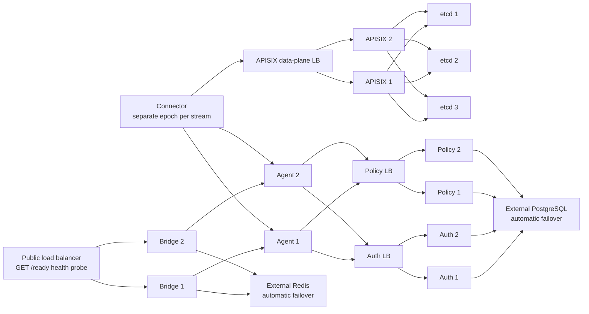

# Production HA topology contract

This document is the production topology contract, not a claim that a
single-machine Compose project is highly available. The checked-in Compose
overlays render and validate service relationships; production must place the
members in independent failure domains or use an orchestrator with equivalent
anti-affinity and health-based routing.

## Required placement and routing

- Bridge 1/Agent 1 and Bridge 2/Agent 2 must not share a host, rack, or zone.
- The public load balancer probes each Bridge `/ready` endpoint and sends new
  traffic only to HTTP 200 targets. TCP-open and `/live` are insufficient.
- Connector uses `SAG_TUNNEL_ENDPOINTS` with both Agent endpoints. Every
  connection creates a new UUID epoch and is eligible only after RegisterAck.
- Auth and Policy each run at least two replicas with shared PostgreSQL truth.
- APISIX runs at least two replicas. Its three-member etcd quorum must place
  each voting member in a different failure domain.
- Production PostgreSQL and Redis are external qualified services with tested
  automatic failover. The release Edge Compose disables its local development
  PostgreSQL/Redis by default; profiles do not turn those containers into HA.

The `docker-compose.hscale-*.yml` and release overlays are topology examples
and static validation inputs. They do not enforce cross-host anti-affinity,
provide managed PostgreSQL/Redis failover, or prove capacity.

## Release sequence

1. Apply forward-compatible PostgreSQL migrations and verify the external
   PostgreSQL/Redis endpoints and three-member etcd quorum.
2. Stop public admission and wait for Bridge, Agent, and Connector drains.
3. Upgrade proto, Connector, both Agents, and both Bridges as one coordinated
   stream-epoch release. Mixed protocol versions are unsupported.
4. Start APISIX/Connector paths, then Auth/Policy, Agents, Bridges, and public
   load balancer targets. Resume ingress only after every `/ready` contract and
   an authenticated/policy/audit full-chain probe succeeds.
5. Enable auth-version enforcement and operator reconciliation only after all
   replicas understand the new database columns and states.

Rollback may use the immediately previous image only when its schema reader is
forward-compatible. Never roll back to a build that trusts caller identity
headers, lacks absolute deadlines, automatically redispatches an unknown
mutation, or cannot understand epoch fields. A protocol rollback requires the
same stop-admission and full-drain window as an upgrade.

## Evidence boundary

Repository validation consists of Rust tests, static HA contracts, and Compose
rendering. Linux scheduling, load-balancer health removal, managed database
failover, Redis promotion, etcd quorum loss, cross-zone latency, and production
capacity remain release-environment acceptance tests.
