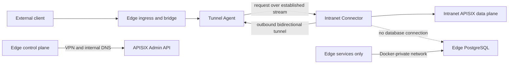

# Connector PostgreSQL Decoupling Design

## Status

Superseded on 2026-07-26 by
[`2026-07-26-connector-postgres-decoupling-revision-design.md`](2026-07-26-connector-postgres-decoupling-revision-design.md).

This file is retained as historical context. Do not use it as the current
architecture baseline: it predates the request deadline, cancellation,
idempotency, and explicit multi-Agent tunnel implementation.

## Context

The deployed system intentionally uses two connectivity models:

- The business data plane uses the reverse tunnel: Edge ingress -> HTTP bridge -> Agent -> Connector -> intranet APISIX.
- The management plane uses VPN/internal DNS: Edge control plane -> intranet APISIX Admin API.

That split is reasonable, but the Connector currently also opens a direct connection to the Edge PostgreSQL instance. The Connector builds the shared storage backend before opening its tunnel and writes per-request audit and fault records directly into the central database. This couples tunnel availability to database reachability, distributes central database credentials into the intranet runtime, and requires Edge PostgreSQL to be reachable across the host/VPN boundary.

The Edge bridge and Agent already persist ingress and tunnel-forward audit records. The Connector also exposes hop-specific Prometheus metrics, including request count, status, upstream latency, accept-queue wait, and response-send latency. The direct Connector audit writes are therefore not required to preserve the primary access audit trail.

## Decision

Remove all direct storage access from `sag-connector`.

The resulting ownership is:

- `sag-connector`: reverse-tunnel client, APISIX forwarder, heartbeat producer, and Prometheus metric producer.
- `stealth-tunnel-agent`: authoritative audit owner for tunnel authorization and forwarding outcomes.
- `http-tunnel-bridge`: ingress-layer audit owner.
- Edge PostgreSQL: private state store used only by Edge-side services over the Docker network.
- `control-plane-admin`: continues reconciling APISIX over VPN/internal DNS.

No protobuf changes or new telemetry RPC are included in this change. If a future requirement needs Connector-specific durable events, add a separate batched telemetry channel after measuring the gap; do not put per-request audit writes back into the Connector.

## Target Architecture

## Alternatives Considered

### 1. Remove Connector persistence and rely on Edge audit plus Connector metrics

Chosen. It is the smallest change that removes the cross-boundary database dependency without changing the forwarding protocol. It preserves the primary audit trail and all existing hop-level Prometheus measurements.

### 2. Send every Connector audit event through the existing tunnel stream

Rejected for this phase. It doubles per-request tunnel messages and makes telemetry compete with responses and heartbeats for the same bounded buffers. It also duplicates records already written at the Edge.

### 3. Add a dedicated client-streaming telemetry RPC or message bus

Deferred. This gives better isolation and batching but adds protocol, buffering, retry, deduplication, and delivery-semantics work. It is justified only if a concrete compliance requirement needs durable Connector-local events.

## Failure Boundaries After the Change

- Tunnel failure stops business forwarding but does not affect APISIX management.
- VPN or DNS failure stops APISIX reconciliation but should not stop forwarding through already-applied APISIX routes.
- PostgreSQL failure affects Edge authentication, policy, control, and audit services according to their existing behavior, but it no longer prevents the Connector from starting or maintaining its tunnel.
- Connector metric-scrape failure loses hop-level observability but does not block forwarding.

## Security Consequences

- Remove PostgreSQL credentials from `.env.intra` and all Connector deployment examples.
- Bind the Edge PostgreSQL host port to loopback only; Edge containers continue to use `postgres:5432` on the Docker network.
- Keep the Agent tunnel endpoint reachable from the intranet over the existing VPN/DNS path.
- Keep APISIX Admin reachable only through the management-plane VPN path.
- Do not claim that this change removes VPN; it removes one unnecessary use of it.

## Success Criteria

1. `sag-connector` has no dependency on `shared_storage` or `uuid`.
2. Connector source and deployment configuration do not reference `SAG_STORAGE_BACKEND`, `SAG_POSTGRES_DSN`, `SAG_CONNECTOR_AUDIT_QUEUE`, or `connector_audit_dropped_total`.
3. Connector starts and establishes the tunnel when PostgreSQL is unreachable and no database variables are present.
4. End-to-end traffic still succeeds through Zentinel/bridge/Agent/Connector/APISIX.
5. Agent and bridge audit records still appear for the request.
6. Connector Prometheus forwarding and latency metrics remain available.
7. Edge PostgreSQL is reachable from Edge containers and Edge localhost, but not from the intranet/VPN address.

## Rollback

The change has no schema migration and deletes no existing records. Rollback consists of reverting the Connector source and manifest, restoring the Connector storage environment variables, restoring the PostgreSQL host binding if cross-host access is temporarily required, rebuilding `sag-connector`, and recreating the Connector container.
