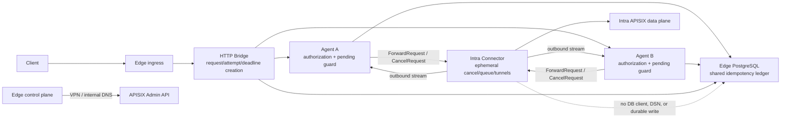

# Connector PostgreSQL Decoupling Revision Design

## Status

Accepted as the current baseline on 2026-07-26. This design supersedes
[`2026-07-25-connector-postgres-decoupling-design.md`](2026-07-25-connector-postgres-decoupling-design.md)
and incorporates the implemented request deadline, cancellation, idempotency,
and explicit multi-Agent tunnel behavior.

The database-decoupling objective is unchanged: `sag-connector` must have no
direct durable-storage dependency and no Edge database credentials.

## Requirements and constraints

### Functional requirements

1. Preserve the reverse data plane: Bridge -> Agent -> Connector -> APISIX.
2. Remove or prevent every direct Connector dependency on `shared_storage`,
   SQLite, PostgreSQL, database environment variables, and durable audit/fault
   writes.
3. Preserve the current protocol contract: logical `request_id`, transport
   `attempt_id`, absolute `deadline_unix_ms`, `idempotency_key`, and
   `CancelRequest`.
4. Preserve Connector runtime state required for correctness: per-tunnel
   cancellation handles, bounded accept queues, in-flight work, and one tunnel
   per explicit Agent endpoint.
5. Keep Agent and Bridge audit ownership on the Edge. Keep the Agent's durable
   idempotency ledger on Edge shared storage.
6. Keep the APISIX management-plane VPN/internal-DNS path unchanged.

### Non-functional requirements

- **Correctness:** a late response cannot complete another attempt; an expired
  request cannot start new downstream work; cancellation cannot erase another
  attempt; a mutating request cannot be gateway-dispatched twice for the same
  principal/application/idempotency-key scope.
- **Availability:** PostgreSQL reachability must not gate Connector startup,
  tunnel maintenance, or read/write forwarding after the Agent has admitted the
  request. PostgreSQL remains a fail-closed Edge dependency for write admission
  and result recording.
- **Security:** Connector images and Intra configuration contain no Edge
  database DSN. Edge PostgreSQL's optional host binding remains loopback-only.
- **Observability:** preserve hop metrics and add guards for cancellation,
  deadline, late-response, pending, idempotency, and queue-expiry metrics.
- **Operability:** live traffic must never cross a mixed incompatible
  Connector/Agent/Bridge generation. Upgrade and rollback are coordinated,
  drained operations.
- **Scope:** no new telemetry RPC, message bus, retry policy, database product,
  or APISIX topology change is introduced.

## Current implementation baseline

The 2026-07-26 code already establishes these facts:

- `shared/tunnel-proto/proto/tunnel.proto` assigns `CancelRequest` to tunnel
  payload tag 5 and carries `attempt_id`, `deadline_unix_ms`, and
  `idempotency_key` on `ForwardRequest`; `ForwardResponse` carries
  `attempt_id`.
- `sag-connector` has no `shared_storage` dependency. It keeps an in-memory
  cancellation map keyed by attempt, rejects duplicate/expired work, races
  reqwest send/body reads against cancellation, and copies `attempt_id` into
  every response.
- `sag-connector` parses `SAG_TUNNEL_ENDPOINTS`, opens one stream to every
  explicit Agent address, and divides total in-flight and accept-queue capacity
  across those streams.
- `stealth-tunnel-agent` owns a generation-aware `PendingRequest` guard. Its
  Drop path removes only the matching attempt, releases the semaphore permit,
  updates `agent_pending_waiters`, and best-effort sends `CancelRequest`.
- Agent claims and completes mutating requests through
  `shared_storage::IdempotencyStore`. Completed results can be replayed;
  conflicting payloads and unresolved pending claims are not dispatched.
- Bridge creates the absolute deadline before reading the body, generates one
  logical request ID and one attempt ID, preserves those fields in Redis queue
  payloads, rejects expired queue work, and performs one tonic Forward attempt.

These are preservation constraints, not cleanup candidates.

## Architecture and state ownership

| Component | Durable responsibility | Required ephemeral state | Database failure behavior |
|---|---|---|---|
| Bridge | Edge ingress audit/fault records | request/deadline construction, gRPC pool, in-flight gates, Redis queue workers | Current cold start fails schema check; running audit failure is best-effort |
| Agent | Audit/fault records and authoritative idempotency ledger access | route/health cache, pending guards, permits, Connector stream registry | Mutating claim failure fails closed before dispatch; completion failure returns indeterminate outcome |
| Connector | None | cancellation registry, accept queues, in-flight HTTP futures, tunnel tasks | Unaffected; no database code or credentials |
| PostgreSQL | Shared Edge state and multi-Agent idempotency records | N/A | Does not cross the Intra trust boundary |

“No persistent state” means a Connector restart may discard local queue and
cancellation bookkeeping. It does not mean those structures can be deleted
while the process is running.

## Decisions and trade-offs

### Decision 1: Keep Connector database-independent, not completely stateless

Remove only durable storage concerns. Preserve `CancelState`, the attempt-keyed
cancellation map, accept queue, deadline checks, response error conversion,
per-tunnel capacity division, and all related metrics.

**Trade-off:** a Connector restart loses in-flight local work, but the Agent
guard cancels/wakes waiters and the durable Edge ledger prevents automatic
duplicate mutation dispatch.

### Decision 2: Keep the idempotency ledger at the Agent/Edge boundary

The Agent performs the atomic claim before sending to Connector and persists a
completed response before returning it. All Agent replicas in production use
the same PostgreSQL. SQLite is a development/single-Agent option only.

The ledger provides at-most-once gateway dispatch and replay of known completed
results, not cross-database exactly-once semantics. The business service must
still honor the propagated `Idempotency-Key`.

### Decision 3: Fail safely at the PostgreSQL boundary

- If PostgreSQL is unavailable before claim, return unavailable/deadline and do
  not send the mutating request to Connector.
- If a claim exists but dispatch has not occurred, only its owner attempt may
  release it.
- Once dispatch is accepted by the Connector stream, a missing completion
  record is indeterminate. Preserve `pending`; never expire or steal it solely
  because time passed.
- Completed records may expire according to the configured TTL. Pending rows
  require reconciliation with the business system.
- Connector tunnels and Connector/APISIX reachability remain independent of
  PostgreSQL. Other Edge auth/policy availability remains governed by their
  existing behavior.

### Decision 4: Treat the protocol generation as operationally incompatible

The protobuf change is additive on the wire but not safe for live mixed-version
traffic:

- An old Agent sends no absolute deadline; the current Connector cannot safely
  give that request a fresh downstream budget.
- An old Connector returns no new attempt ID; the current Agent cannot match a
  response to a random attempt-keyed pending guard.
- An old Bridge does not enforce the current one-attempt and idempotency
  contract.

Fallbacks for empty fields exist only to make failures diagnosable and direct
callers bounded; they are not authorization to perform a rolling mixed upgrade.

### Decision 5: Keep telemetry on existing Edge audit plus hop metrics

Do not add per-request Connector database writes or a new telemetry channel.
If compliance later requires durable Connector-local events, design a separate
batched and deduplicated channel outside this change.

## Alternatives considered

### Restore Connector PostgreSQL access

Rejected. It reintroduces cross-boundary credentials, makes tunnel startup
depend on Edge database reachability, and duplicates Edge audit ownership.

### Remove every Connector map and queue to make it “fully stateless”

Rejected. The structures are request-lifetime coordination state. Removing them
breaks cancellation, deadline enforcement, duplicate-attempt isolation, and
bounded concurrency.

### Move the idempotency ledger to Connector

Rejected. It would restore the database coupling and make multi-Agent safety
depend on Intra-local state. The claim belongs before Connector dispatch.

### Allow rolling mixed versions because protobuf fields are additive

Rejected. Wire parsing may succeed while attempt correlation, deadline, and
idempotency semantics fail.

## Failure modes and mitigations

| Failure | Observable result | Required invariant / mitigation |
|---|---|---|
| PostgreSQL unavailable at Agent/Bridge cold start | Process exits during schema check | Restore Edge database, verify schema, then start the coherent release |
| PostgreSQL unavailable before mutating claim | gRPC unavailable/deadline; no APISIX call | Alert on `agent_idempotency_total`/logs; do not bypass the ledger |
| PostgreSQL unavailable after downstream response | Client sees indeterminate error; claim remains pending | Reconcile against business system; never auto-steal pending |
| Bridge/client deadline expires | Agent pending guard drops and emits cancel | Permit/gauge return to zero; late responses are counted, not reassigned |
| Cancel before Connector dispatch | No APISIX request | Connector removes/cancels the matching attempt only |
| Cancel during APISIX HTTP | reqwest future/body read is dropped | Cancellation is resource reclamation, not transaction rollback |
| One Agent tunnel fails | Requests routed to that Agent fail; other explicit tunnels remain | Connector maintains a stream for every listed Agent; do not use one random LB address |
| Mixed release starts receiving traffic | Semantically invalid requests/responses | Stop entry, drain, deploy the complete version set, then resume |

## Security consequences

- Intra Connector configuration contains no `SAG_STORAGE_BACKEND`,
  `SAG_POSTGRES_DSN`, or Connector audit-queue variable.
- Edge PostgreSQL host binding is `127.0.0.1:5432:5432`; Edge containers use
  `postgres:5432` on the Docker network.
- Every production Agent replica receives the Edge-internal PostgreSQL DSN.
- The Agent scopes the idempotency key by application and verified principal
  (or credential hash) so a guessed key cannot replay another caller's body.
- The APISIX Admin VPN path and Connector mTLS tunnel remain separate.

## Release and rollback constraints

1. Build and identify one coherent Connector/Agent/Bridge release before the
   maintenance window.
2. Stop ingress and direct Bridge entry, then drain Redis queue length/pending,
   Bridge synchronous in-flight work, and Agent pending waiters to zero.
3. Stop Bridge, Connector, and every Agent before replacing any protocol
   participant.
4. Recreate (not delete the volume for) the Edge PostgreSQL container, verify
   health, apply the idempotent schema, and verify `idempotency_records`.
5. Start every Agent, then Connector with all explicit Agent endpoints, then
   Bridge. Resume ingress only after tunnel, metrics, read, write, replay,
   conflict, deadline, and cancel checks pass.
6. Roll back the three binaries/configurations as one known-compatible set.
   Never live-downgrade only one participant. Do not restore Connector database
   access or public PostgreSQL exposure.

## Success criteria

1. Connector source, manifest, dependency tree, and Intra configuration have no
   storage dependency or database/audit-queue variable.
2. Proto tags and all request-correctness fields remain unchanged.
3. Connector preserves cancellation, deadline, attempt correlation,
   idempotency-key forwarding, bounded queues, and explicit multi-Agent
   tunnels.
4. Agent preserves generation-aware RAII pending cleanup and uses shared Edge
   PostgreSQL for multi-Agent idempotency.
5. PostgreSQL claim and completion failure tests prove the documented
   fail-closed/indeterminate boundaries.
6. Bridge preserves one attempt, deadline-before-body behavior, queue field
   serialization, and expired-job rejection.
7. Metrics and structured logs cover pending, late response, cancel, deadline,
   body errors, idempotency outcomes, and queue expiry.
8. Focused tests, workspace checks, the architecture guard, and Edge/Intra/combined
   Compose rendering all pass.
9. The runbook explicitly prohibits incompatible live mixing and contains
   stop/drain, PostgreSQL recreate/schema, coordinated start, verification, and
   whole-set rollback steps.

