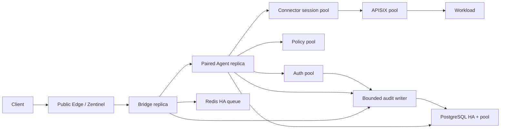
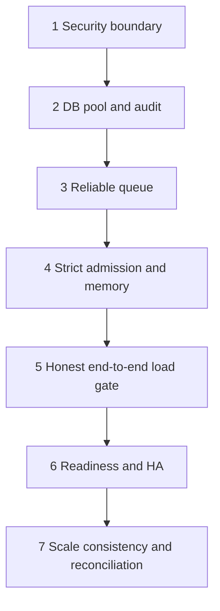

# Seven-Point Production Hardening Design

## Status

Proposed on 2026-07-26. This document turns the adversarial review into one
coordinated production-hardening programme. It preserves the accepted deadline,
cancellation, idempotency, Connector lease, and Connector/PostgreSQL decoupling
decisions already present in this repository.

## Goal

Close the seven identified production risks without rewriting the gateway:

1. Enforce the authentication trust boundary and remove unsafe port exposure.
2. Replace per-operation PostgreSQL connections and unbounded audit tasks.
3. Make the Redis overload queue recoverable and observably durable.
4. Make admission control strict and give every process an explicit memory budget.
5. Replace the misleading routed-only capacity claim with an end-to-end SLO test.
6. Add truthful readiness, graceful recovery, and a deployable HA topology.
7. Repair horizontal-scale configuration, cross-instance auth state, and
   indeterminate idempotency reconciliation.

## Approaches considered

### A. Big-bang gateway rewrite

Replace the Bridge/Agent/Connector chain with an off-the-shelf tunnel or service
mesh and rebuild the control plane around it. This could reduce custom code, but
it discards working cancellation, deadline, certificate-binding, and
idempotency behaviour. Migration and semantic regression risk are too high.

### B. Phased in-place hardening — chosen

Keep the current request path and repair one failure boundary at a time. Each
phase has an independent acceptance gate and rollback point. Additive database
migrations remain compatible with the previous binary until the corresponding
feature is enabled. This gives the fastest reduction in real risk while keeping
the system operable during the programme.

### C. Infrastructure-only mitigation

Hide ports behind firewalls, increase limits, and add more replicas without
changing application code. This helps exposure and process failure, but it does
not fix identity spoofing, PostgreSQL connection storms, Redis pending-message
loss, admission races, or misleading success criteria. It is insufficient.

## Architecture principles

1. **One authenticated identity source.** Caller-supplied identity headers are
   always removed. Only the Agent may add canonical identity headers after
   successful token verification.
2. **Bound every resource.** Database connections, audit work, HTTP admission,
   queue workers, body bytes, stream messages, and shutdown drain all have hard
   limits and explicit rejection behaviour.
3. **Do not turn dependency failure into overload.** Redis enqueue failure
   returns 503 in production; it does not fall back to an unbounded synchronous
   path. PostgreSQL audit failure cannot spawn unlimited tasks.
4. **At-least-once queue, at-most-once gateway dispatch for mutations.** Redis
   workers may reclaim jobs, while Agent idempotency prevents a second mutation
   dispatch. A possibly executed mutation remains indeterminate until reconciled.
5. **Liveness is not readiness.** A running event loop is live. A component is
   ready only when the dependencies needed for its advertised operation are
   ready.
6. **Capacity means expected business response.** HTTP 500 is never counted as
   a successful business request. Transport reachability remains a separate KPI.
7. **Scale by complete paths.** Adding a Bridge without a reachable Agent,
   Connector return stream, valid mTLS identity, and shared idempotency ledger is
   not a valid replica.

## Target request path

The Bridge and Agent remain separate because their failure domains and trust
roles differ. Connector remains database-independent. PostgreSQL stays off the
Intra data plane. Redis remains an overload queue and cache, not the source of
truth for authorization or mutation completion.

## Design decisions by repair point

### 1. Authentication trust boundary

- When `SAG_AUTH_VERIFY_ENDPOINT` is configured, a missing or invalid Bearer
  token is always rejected. Caller identity headers are never a fallback.
- Bridge strips `x-sag-user-*`, `x-user-*`, and other internal assertion headers.
- Agent verifies the token, evaluates Policy using the verified identity, then
  overwrites the forwarded request with canonical `x-sag-user-id` and
  `x-sag-user-roles` values.
- Bridge, Redis, etcd, and APISIX Admin are internal-only by default. A debug
  profile may publish loopback-bound ports.
- Production mode refuses known development secrets and plaintext control-plane
  endpoints outside explicitly allowed private networks.

### 2. PostgreSQL and audit path

- `PostgresStore` owns a bounded shared connection pool with acquisition,
  connect, and query timeouts. No storage method opens a new TCP connection.
- Data-plane audit uses one bounded per-process channel and batch inserts.
  Queue-full and database-failure counters are mandatory.
- Security-critical admin mutations write their audit row transactionally or
  fail the mutation. High-volume forwarding audit may degrade by dropping with
  an explicit metric after the bounded queue fills.
- All IDs use UUIDs. Audit/fault tables receive time and common-filter indexes,
  plus a documented retention job.
- PostgreSQL TLS is configurable and required whenever the database connection
  leaves the local container network.

### 3. Redis queue reliability

- A Lua script atomically checks capacity, appends the stream entry, creates the
  job record, and applies TTL. The bounded stream is not approximately trimmed
  while unacknowledged entries exist.
- Workers read new entries and periodically reclaim abandoned pending entries
  with `XAUTOCLAIM`. The reclaim idle time exceeds the maximum forward deadline
  so a healthy slow worker is not duplicated.
- Result persistence and `XACK`/`XDEL` happen atomically. Failure/DLQ persistence
  happens before acknowledgement.
- Deduplication errors fail closed; `unwrap_or(true)` is removed.
- Production Redis uses a persistent volume, AOF, authentication/TLS, and an HA
  endpoint. The documented queue RPO must match the deployment tier.

### 4. Admission and memory

- A hard ingress permit is acquired before reading a request body.
- A separate sync-path permit replaces the racy load-then-increment counter.
  Failure to acquire sends an eligible request to Redis or returns 503.
- Production defaults disable synchronous fallback after Redis failure.
- Startup validates the combined concurrency/body/buffer configuration against
  a declared per-process memory budget. Unlimited body configuration is rejected
  in production.
- Stream buffer, accept queue, and in-flight defaults are reduced, then raised
  only from measured evidence. Metrics gauges derive from permit ownership.

### 5. Capacity verification

Three independent tests are retained:

1. Transport reachability: did the request traverse Bridge/Agent/Connector?
2. Workload capacity: did a controlled upstream return the expected 2xx body?
3. Full chain: did Auth, Policy, idempotency, audit, tunnel, APISIX, and workload
   all satisfy the SLO?

The stable capacity is 70% of the first repeatable saturation knee, not the
requested generator rate. A candidate release cannot pass if HTTP 500 is counted
as success, the load generator drops iterations, or any required component is
excluded without an explicit test label.

### 6. Readiness and HA

- Every service exposes `/live` and `/ready`. Readiness includes its required
  dependencies and has a bounded check timeout.
- Connector readiness requires registration acknowledgement and APISIX
  reachability; a metrics socket alone is insufficient.
- Bridge readiness requires an Agent channel and, when queue mode is enabled, a
  usable Redis queue. Agent readiness requires route sync and the configured
  minimum healthy Connector sessions.
- SIGTERM stops admission, drains within a fixed deadline, then cancels work.
- The production topology uses at least two complete Bridge→Agent paths, two
  Auth/Policy replicas, PostgreSQL failover, Redis failover, APISIX replicas, and
  a three-member etcd cluster. Development Compose remains explicitly single-node.

### 7. Horizontal scaling and reconciliation

- Compose extension fields define one Bridge environment block, including all
  mTLS variables, so replicas cannot silently diverge.
- Auth uses PostgreSQL as the user source of truth. User mutations increment an
  `auth_version` and publish invalidation; every instance bounds cache staleness
  and rejects tokens whose version is no longer current.
- The proposed stream-epoch/RegisterAck design is completed before calling a
  Connector replica ready in a multi-Agent deployment.
- Idempotency states distinguish `claimed`, `dispatched`, `completed`, and
  `indeterminate`. Dispatched/indeterminate rows are never automatically stolen.
- An authenticated operator API and CLI list old indeterminate records and
  record one of two audited decisions: confirmed completed with a supplied
  result, or confirmed not executed and safe to release.

## Delivery order and compatibility

Points 1 and the safe parts of point 2 may ship immediately. Points 3 and 4
must land before a new capacity claim. Point 5 is a release gate for points 6
and 7. Protocol changes in point 7 require a stopped-and-drained coordinated
Bridge/Agent/Connector rollout as already documented by ADR-0002.

## Rollback model

- Database migrations are additive until the new binaries have passed soak.
- Security boundary rollback is not allowed to re-enable forged identity; a
  break-glass internal service token is preferable to an insecure fallback.
- Audit writer, new queue worker, and strict admission have feature flags for
  one-release rollback, but production defaults remain safe/fail-closed.
- Queue rollout drains old consumer groups before switching scripts/workers.
- HA rollout adds the second complete path before removing the first.
- Idempotency schema rollback leaves new states readable; destructive downgrade
  is forbidden once an indeterminate record exists.

## Programme success criteria

1. Forged identity headers cannot reach Policy or upstream as trusted identity.
2. PostgreSQL active connections never exceed the configured aggregate pool
   budget during peak load or database failure.
3. Killing a queue worker after delivery does not strand or silently lose a job.
4. A synchronized burst cannot exceed the configured hard or sync permits.
5. The published capacity test includes Auth, Policy, audit, and expected 2xx
   semantics and passes three consecutive runs plus a soak run.
6. Killing any one Bridge, Agent, Auth, Policy, APISIX, Redis primary, or
   PostgreSQL primary satisfies the declared RTO and does not authorize a
   request incorrectly.
7. A user disable/role change converges across Auth replicas within the declared
   revocation SLO, and every old indeterminate mutation has an auditable
   reconciliation path.

